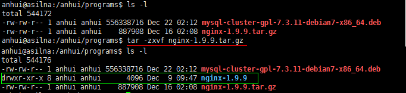
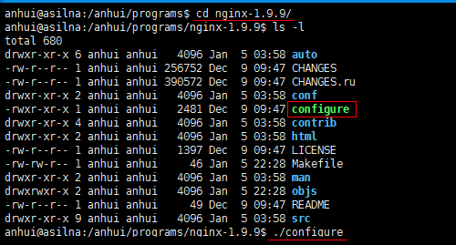
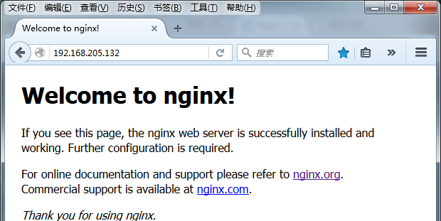

# Ubuntu下安装Nginx1.9.9  

### 1. 下载  

nginx主页：[http://nginx.org/](http://nginx.org/)  
nginx下载页：[http://nginx.org/en/download.html](http://nginx.org/en/download.html)  
nginx1.9.9 linux版：[http://nginx.org/download/nginx-1.9.9.tar.gz](http://nginx.org/download/nginx-1.9.9.tar.gz)  
nginx1.9.9 windows版: [http://nginx.org/download/nginx-1.9.9.zip](http://nginx.org/download/nginx-1.9.9.zip)  

下载后存放路径 /anhui/programs/nginx-1.9.9.tar.gz  

### 2. 解压  

通过 `tar -zxvf ./nginx-1.9.9.tar.gz` 命令解压得到 nginx-1.9.9目录  
  
  

### 3. 安装
首先通过 `cd ./nginx-1.9.9` 进入nginx1.9.9 目录，然后我们查看该目录可以发现有个configure文件，运行该文件检查本机配置: `./configure`  

  

如果出现以下错误，则需要安装各种依赖工具和库  

  

首先运行`sudo apt-get update`命令更新库  
然后运行`sudo apt-get install gcc libpcre3 libpcre3-dev openssl libssl-dev make`安装所有的工具和依赖库  
然后再`./configure`检查一下
若不报错，则运行`sudo make & make install` 进行编译和安装  
   
若不报错则安装完成，通过`sudo /usr/local/nginx/sbin/nginx`来启动安装好的nginx  
如果不报错则启动完成，在浏览器中访问本机80端口`http://xxx.xxx.xxx.xxx/`(本机用localhost或127.0.0.1) 得到如下页面则表示正确安装  

  

### 4. 配置  
当然我们还需要对nginx进行配置了，本章就做一些简单的配置介绍。

由于个人对vi之类的编辑神器不会使用，所以自己找了一个nano（通过`sudo apt-get install nano`来安装）来编辑文件，很符合习惯了windows的我。  

直接贴上我的配置：

    # 运行用户
    # user anhui;
    # 启动进程,通常设置成和cpu的数量相等
    worker_processes  1;
    
    # 全局错误日志及PID文件
    # error_log  logs/error.log;
    # error_log  logs/error.log  notice;
    # error_log  logs/error.log  info;
    
    # pid        logs/nginx.pid;
    
    # 工作模式及连接数上限
    events {
        #单个后台worker process进程的最大并发链接数
        worker_connections  1024;
    }
    
    # 设定http服务器，利用它的反向代理功能提供负载均衡支持
    http {
        # 设定mime类型,类型由mime.type文件定义
        include       mime.types;
        default_type  application/octet-stream;
    
        # 设定日志格式
        # log_format  main  '$remote_addr - $remote_user [$time_local] "$request" '
        #                  '$status $body_bytes_sent "$http_referer" '
        #                  '"$http_user_agent" "$http_x_forwarded_for"';
    
        # access_log  logs/access.log  main;
    
        # sendfile 指令指定 nginx 是否调用 sendfile 函数（zero copy 方式）来输出文件，对于普通应用，
        # 必须设为 on,如果用来进行下载等应用磁盘IO重负载应用，可设置为 off，以平衡磁盘与网络I/O处理速度，降低系统的uptime.
        sendfile        on;
        # tcp_nopush     on;
        
        # 连接超时时间
        # keepalive_timeout  0;
        keepalive_timeout  65;
    
        # 开启gzip压缩
        gzip  on;
        gzip_disable "MSIE [1-6]\.(?!.*SV1)";
    
        # 设定负载均衡的服务器列表
        upstream mysvr {
            server 127.0.0.1:38001 weight=5;
            server 127.0.0.1:38002 weight=5;
            server 127.0.0.1:38003 weight=5;
            server 127.0.0.1:38004 weight=5;
        }
        
        # 服务器设定
        server {
            # 侦听80端口
            listen       80;
            # 定义使用www.xx.com访问
            # server_name   www.xx.com;
            
            # 定义使用localhost访问
            server_name   localhost;
    
            # charset koi8-r;
    
            # 设定本虚拟主机的访问日志
            # access_log  logs/host.access.log  main;
    
            # 默认请求
            location / {
                root   html;
                index  index.html index.htm;
                
                #请求转向mysvr 定义的服务器列表
                proxy_pass http://mysvr;
            }
        }
    ｝

转载一篇配置详细介绍文章： [http://www.cnblogs.com/xiaogangqq123/archive/2011/03/02/1969006.html](http://www.cnblogs.com/xiaogangqq123/archive/2011/03/02/1969006.html)  

修改配置之后可以通过`sudo /usr/local/nginx/sbin/nginx -s reload`来重启nginx    
以及通过`sudo /usr/local/nginx/sbin/nginx -t -c /usr/local/nginx/conf/nginx.conf` 验证配置文件是否正确　