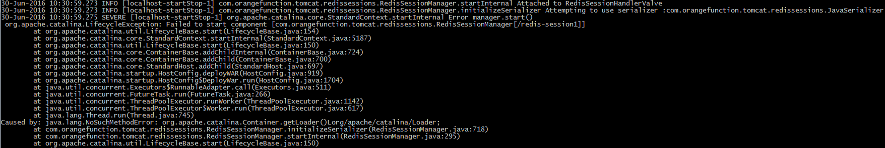
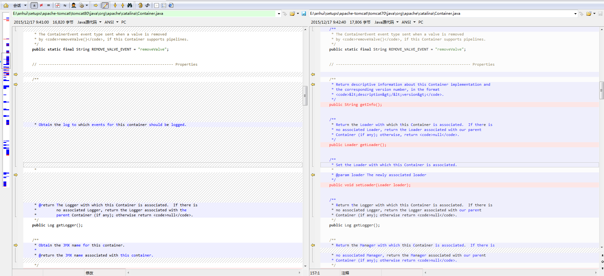
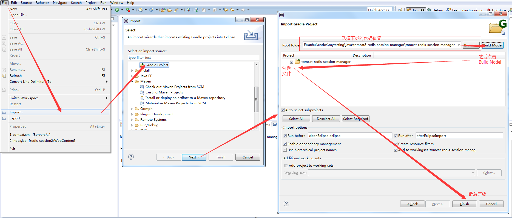
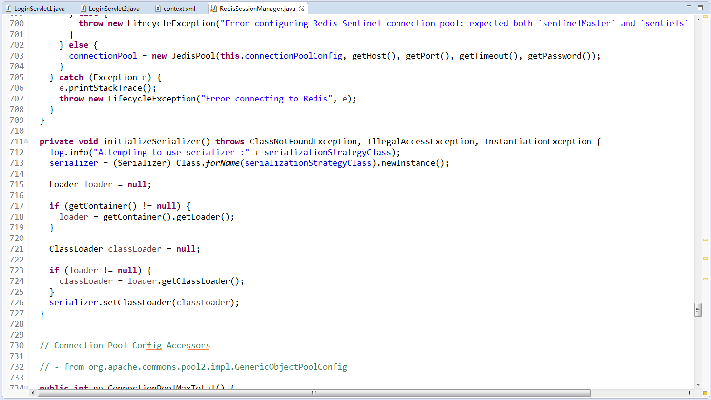
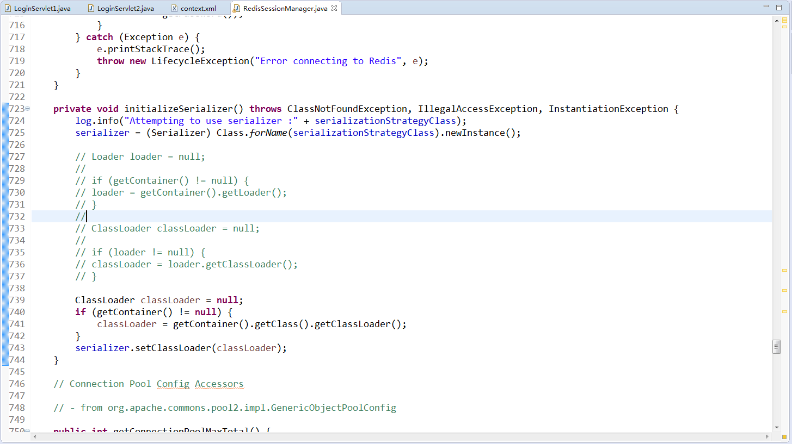
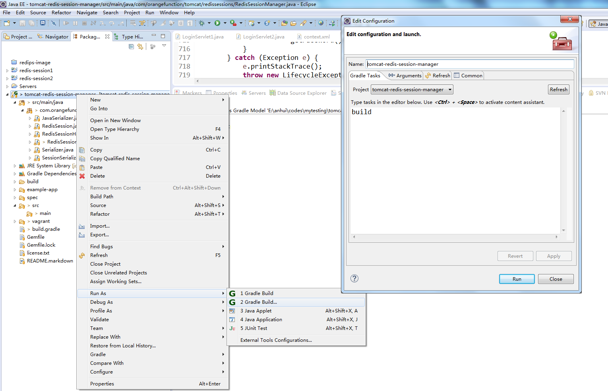
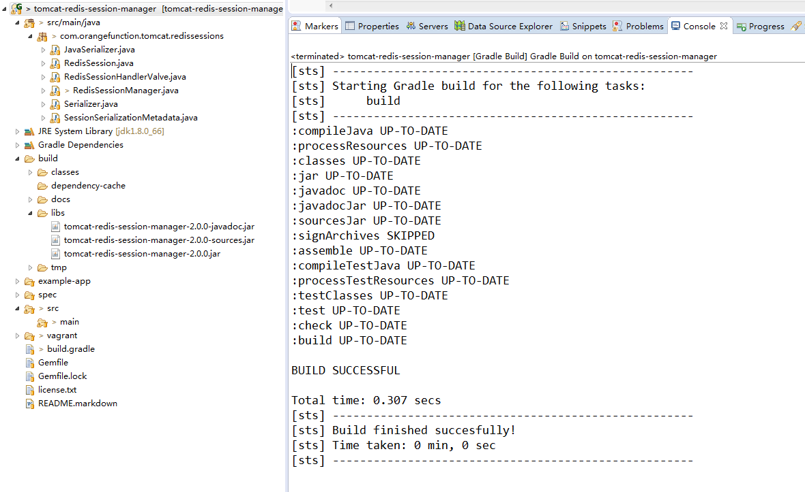
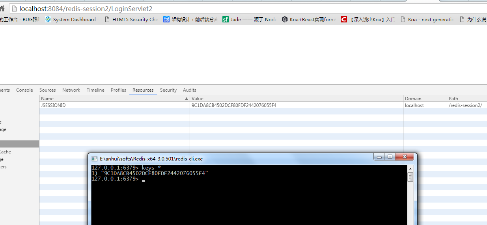

## Tomcat8依赖redis配置集群实现session共享 
很久以前分享了一篇[tomcat7依赖redis配置集群实现session共享](./1.tomcat7依赖redis配置集群实现session共享.md)，当时我们依赖了James Coleman同学编写的`tomcat-redis-session-manager`项目:https://github.com/jcoleman/tomcat-redis-session-manager

但是该项目目前只支持Tomcat6和Tomcat7，然后James同学说他很忙没空：
>I currently don't have the time to add Tomcat 8 support in my spare time. However if you're interested in Tomcat 8 support for your particular use case and/or business, as the README notes, I'm available as a consultancy on a contractual basis. If you'd like to pursue getting this feature added at a contract rate (and gain some commercial support as well), feel free to contact me at james@orangefunction.com.

好吧,看样子短时间内James同学是不打算对Tomcat7以上的版本进行适配了，但是Tomcat到目前位置依旧到了9的版本了，有很多为了装逼的强迫症患者(比如我)如果没有换上最新的,总是睡不好觉。所以为了睡个好觉我准备折腾一把。

本文只对Tomcat8进行了适配，Tomcat9貌似还是不行的，下一次有时间我们再折腾，有这次经历之后我想下一次我们会很更容易的。

## 1. 让我们先来看看在Tomcat8上运行的效果吧  

看样子是`tomcat-redis-session-manager`中的`com.orangefunction.tomcat.redissessions.RedisSessionManager`类中的`initializeSerializer`方法在调用Tomcat的`org.apache.catalina.Container`的`getLoader()`方法时出现了`NoSuchMethodError`

## 2. 比较Tomcat8和Tomcat7的源码
既然是上面这样的情况，那我们就把tomcat的两个版本源码比较看看这个`Container`有什么区别呢，首先需要到apache官网上下载这两个版本的源码，具体步骤不说了，因为不知道为什么也不知道是天杀的谁干的我们公司居然无法访问apache.org，我也是很醉呀，只好叫朋友帮忙下载的。

二话不说用比较神器Beyound Compare比较一下:  

比较结果很满意，果然在Tomcat7里面有的getLoader方法在Tomcat8中已经没有了(然后我们也知道了`Cotainer`原来是一个接口)，但是Tomcat7里面之前也没有@Deprecated，真是一言不合直接删api,所以搞得我们也很凌乱。

BUT。。。我们不可能为了这个事情去修改Tomcat的源码。。。SO。。。那就只好拿James同学的代码开刀了,况且James先生好像也也乐意自己的代码被你爆菊花的样子。。。

## 3. 找到需要修改的代码  

那么说干就干吧,首先用eclipse导入`tomcat-redis-session-manager`的代码，这里我要申明IDEA的确是世界上最好的编程工具，但是曾今年少轻狂的我发誓此生要对对eclipse忠贞不渝，所以即便是风情万种的IDEA在我面前搔首弄姿，我将永远不为所动。。。T.T，请原谅我的懒，不想去学习使用新的工具。。。  

既然是用的eclipse，导入时请注意在import时选择导入gradle project，这样的话就能用eclipse自带的gradle插件进行build了(导入时如果点击Build Model时出错,请看上一篇文章中的gradle编译出错的解决方案)

 

然后根据异常信息我们找到了com.orangefunction.tomcat.redissessions.RedisSessionManager类的`718`行:  
  

果然使用到了在Tomcat8中已经删除的`getLoader`方法`loader = getContainer().getLoader();`  

我们接着往下看，获取到`loader`之后，然后调用`loader`的`getClassLoader`方法来获取了一个`ClassLoader`类的对象。那么也就是说此处需要一个Tomcat环境的类加载器。  

## 4. 修改代码  
那么我们已经知道了该代码的意图，那么就尝试动手改吧。  

也不知道还会不会有什么地方有问题, 试一把才知道。

## 5. 用gradle编译打包
 
  

很快就打包好了，感觉gradle比maven要快很多呢。

  

## 6. 测试  
包打好之后就迫不及待的想要试试了  

1. 将`tomcat-redis-session-manager-2.0.0.jar`包以及依赖的`jedis-2.5.2.jar`、`commons-pool2-2.2.jar`包都copy到Tomcat的lib目录下  
2. 在Tomcat的`conf/context.xml`文件中加入使用redis-session的配置  
    &lt;Valve className="com.orangefunction.tomcat.redissessions.RedisSessionHandlerValve" /&gt;
    &lt;Manager className="com.orangefunction.tomcat.redissessions.RedisSessionManager"
        host="localhost"
        password="xx-xx"
        port="6379"
        database="0"
        maxInactiveInterval="60"
        /&gt;
     
     *注意Valve必须配置在Manager之前*
3. 启动redis服务器  
4. 通过浏览器访问测试  

结果如下:  

  

## 6. 最后  

我从James哪里fork了一份代码，按照我的想法新建了一个tomcat8分支，并把修改的代码提交上去了。如果需要你也可以去下载：  
[https://github.com/anhui3713/tomcat-redis-session-manager/tree/tomcat-8](https://github.com/anhui3713/tomcat-redis-session-manager/tree/tomcat-8)

但是我也没有勇气将代码提交给James，万一还有坑呢。所以先留着自己玩吧。

最后呢，还是将所有的jar包上传到百度云，如果你懒得自己搞也可以直接下载并使用:

http://pan.baidu.com/s/1dELCFVb