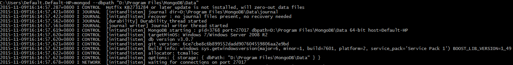
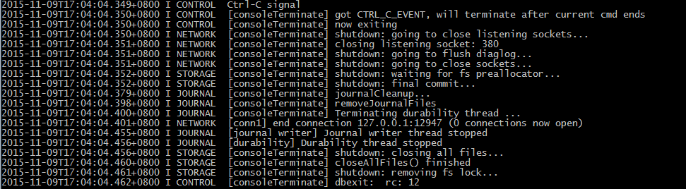
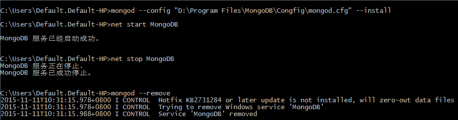

# MongoDB 安装配置
## 1.下载安装包  
*  [下载地址](https://www.mongodb.org/downloads)  

## 2. 安装  
*  选择Custom自定义安装并设置好安装地址后猛击下一步  

## 3. 配置  
*  将安装后的地址配置到环境变量中  
    在Path中加入MongoDB的安装位置：D:\Program Files\MongoDB\Server\3.0\bin 

## 4. 启动  
* mongod  
>windows下的mongodb默认采用当前盘符下的\data\db目录作为数据目录，如果当前命令环境为D盘则会使用D:\data\db
>如果当前盘符根目录下没有该文件夹，则会报错，需要通过手动创建。  

* mongod --path xxx 自定义数据目录启动
>xxx表示数据文件目录，如果有空格则使用双引号括起来，如：mongod --dbpath "d:\test\mongo db data"  

      

## 5. 连接并操作数据库  
* mongo  

      

## 6. 停止数据库  
* 直接在启动的窗口中Ctrl + C即可停止mongodb服务器

      

## 7. 编写便捷bat执行文件  
当然，每次都要指定数据文件地址这样敲命令是一件很累的事情，在windows下我们可以将命令写成批处理文件保存之后方便执行

#### 7.1 创建mongodb服务  
* 首先创建mongod.cfg配置文件，并在其中配置systemLog.path和storage.dbPath  
文件： D:\Program Files\MongoDB\Congfig\mongod.cfg:  

    systemLog:
        destination: file
        path: c:\data\log\mongod.log
    storage:
        dbPath: c:\data\db

* 然后安装MongoDB服务  
·mongod --config "D:\Program Files\MongoDB\Congfig\mongod.cfg" --install·

* 通过net start MongoDB来启动mongodb服务  
* 通过net stop MongoDB来停止mongodb服务  
* 通过mongod --remove来删除mongodb服务    
     
     
<!--
#### 7.2 安装自动启动的服务
-->