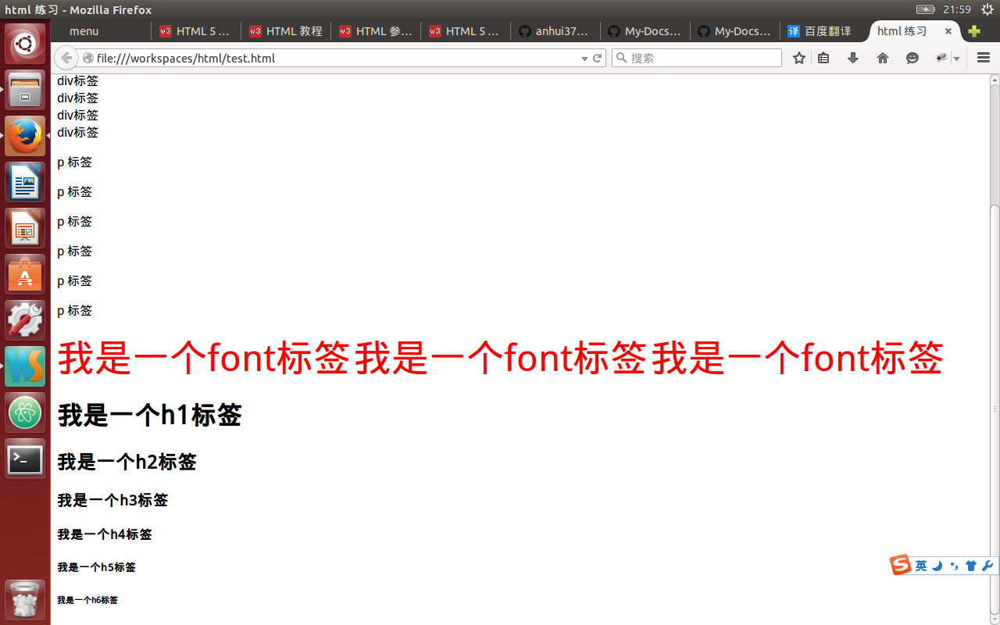

# HTML基础 
1. span div p font  
* span 行级元素,多个标签显示到同一行,如果超出一行则按文字换行,标签中的内容可能会被拆分到多行显示.  
* div 块级元素,每一个div标签独占一行.  
* p 块级段落元素,每一个p标签跟相邻标签都间隔一行  
* font 行级字体样式标签
2. 标题标签(h1~h6)  
    h1~h6 加粗,黑体的6个等级的标题元素  
    
3. 超链接  
4. 图片  
5. 列表  
6. 转义符和换行  
7. 水平线  
8. 带标题的框  
9. 表格  
10. 表单  
11. 框架(frameset,iframe)  
12. meta标签  
13. HTML版本  
# HTML5
##新增标签
1.声音  
2.视频  
3.矢量图  
4.拖放  
5.画布  
6.地理定位  
##删除标签
frameset,font
