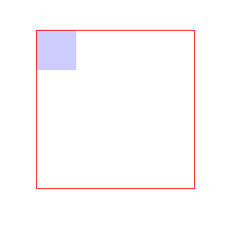
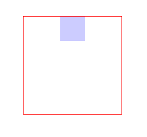
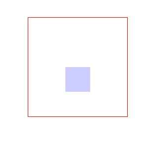
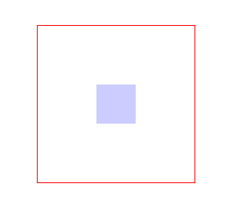

## 我们经常会遇到想要使控件水平和垂直都居中的情况  

想起来还是很简单的，比如水平居中可以用text-align: center或者margin: 0px auto来实现。所以有人想当然的就认为可以设置vertical-align: middle或着margin:auto 0px;来实现垂直居中。但是呢，貌似整死都是不行的。今天给大家分享一种实现垂直居中的方法，应该不是最好的方式，但是是我目前能想到的最好的方式。  

### 首先编写两个div，并用边框和背景区分开

    

    

      

      

    

    
效果如下：  

### 接着设置水平居中，在.block中添加margin: 0px auto; 
    .block{
      width: 50px;
      height: 50px;
      background-color: #ccf;
      margin: 0px auto;
    }
    
效果如下:  

### 然后我们可以天真一次，尝试修改刚才添加的代码为argin: auto auto;  
    .block{
      width: 50px;
      height: 50px;
      background-color: #ccf;
      margin: auto auto;
    }
    
然后，效果...依然是之前的那个鬼样子：  

### 所以这么设置是无效的，那么我们该如何实现垂直居中呢？且看如下代码：  
    .block{
      width: 50px;
      height: 50px;
      background-color: #ccf;
      margin: 0px auto;
      
      position: relative;
      top: 50%;
    }
    
没错，将元素定位到父元素50%处，先看效果：  

### 等等，请先别喷...我想你应该是可以想明白为什么是这样子的。但是这又怎么办呢？且看我再加一行代码：  
    .block{
        width: 50px;
        height: 50px;
        background-color: #ccf;
        margin: 0px auto;
        
        position: relative;
        top: 50%;
        
        -webkit-transform: translateY(-50%);
           -moz-transform: translateY(-50%);
            -ms-transform: translateY(-50%);
             -o-transform: translateY(-50%);
                transform: translateY(-50%);
    }

说是一行代码，实际上加了5行，但是我们就是这么任性，好了，再来看效果：  

### 好了，大功告成